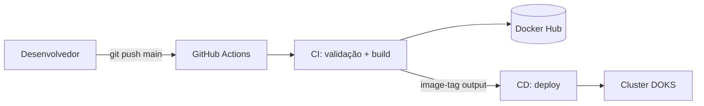

# Pipeline CI/CD para deploy do kube-news em DOKS

## Contexto

O `kube-news` é uma aplicação Node.js/Express usada como artefato didático para aulas de containers, Kubernetes e CI/CD. Até este momento, o processo de deploy é **inteiramente manual** e executado da máquina do desenvolvedor:

1. `docker build` local
2. `docker push` para o Docker Hub (`fabricioveronez/evento-kube-news`)
3. `kubectl apply` contra o cluster

O gatilho desta definição é o aumento da **frequência de deploys** — hoje em torno de 2 por dia — que tornou o processo manual um gargalo operacional. A demanda agora é por automatização que garanta **velocidade e qualidade** no deploy, e que sirva também como artefato didático em aulas de CI/CD.

O ambiente alvo é o cluster DOKS descrito em `docs/arquitetura-cloud-digitalocean.md`.

## Problema

O deploy manual hoje consome cerca de **1 hora de trabalho por execução**, e isso acontece **2 vezes por dia** — totalizando aproximadamente 2 horas diárias de tempo de desenvolvedor gasto apenas em entrega.

O impacto principal não é só o tempo somado, mas a **janela de risco**: durante essa 1 hora de execução manual, qualquer passo esquecido, tag errada ou divergência entre a versão da máquina local e o cluster pode quebrar o ambiente. É 1h por deploy × 2 deploys/dia de exposição a erro humano em um processo crítico.

Escopo: o problema afeta o ciclo de entrega da aplicação no cluster DOKS. Não cobre testes automatizados (a aplicação não tem suite de testes — o script `npm test` é placeholder).

## Solução proposta

Implementar dois workflows GitHub Actions separados em `.github/workflows/`, com o CI invocando o CD via `workflow_call` — assim o CD só roda quando o CI passou (validação + build), e o reuso fica explícito.



**Estrutura:**

```
.github/workflows/
├── ci.yml
└── cd.yml
```

**`ci.yml`** — gatilhos: `push` em qualquer branch + `pull_request`.

- Job `validate`: `actions/checkout` → `actions/setup-node@v4` com cache npm → `npm ci` em `src/`
- Job `build-and-push` (`needs: validate`, apenas em `push` na `main`):
  - `actions/checkout` → `docker/setup-buildx-action` → `docker/login-action` (Docker Hub) → `docker/build-push-action`
  - Contexto de build: `./src`
  - Imagem: `fabricioveronez/evento-kube-news:${{ github.run_number }}`
  - Cache: `type=gha`
  - **Output:** `image-tag: ${{ github.run_number }}`
- Job `call-cd` (`needs: build-and-push`, apenas em `push` na `main`): `uses: ./.github/workflows/cd.yml` com `secrets: inherit` e `with: image-tag: ${{ needs.build-and-push.outputs.image-tag }}`

**`cd.yml`** — gatilhos: `workflow_call` (recebe `inputs.image-tag`) + `workflow_dispatch` (pede `image-tag` como input manual).

- Job `deploy`:
  - `environment: production`
  - `concurrency: deploy-main` (impede deploys simultâneos)
  - `azure/k8s-set-context@v4` recebendo kubeconfig do secret `KUBE_CONFIG`
  - `kubectl apply -f k8s/`
  - `kubectl -n kube-news set image deploy/kube-news kube-news=fabricioveronez/evento-kube-news:${{ inputs.image-tag }}`
  - `kubectl -n kube-news rollout status deploy/kube-news --timeout=180s`

**Tag da imagem:** `${{ github.run_number }}` — número monotônico incremental do workflow, ótimo didaticamente (a 47ª execução gera `:47`). Gerada no CI e passada ao CD via output do `workflow_call`.

**Mapa de impacto:**

- **Repo:** dois arquivos novos em `.github/workflows/`. Nenhum arquivo existente é modificado pela pipeline.
- **Docker Hub** (`fabricioveronez/evento-kube-news`): passa a receber pushes automatizados com tags numéricas crescentes (`:1`, `:2`, `:3`, ...).
- **Cluster DOKS, namespace `kube-news`:** passa a receber `apply` + `set image` + `rollout status` automatizados a partir do GitHub Actions.
- **Fluxo do desenvolvedor:** deixa de rodar `docker build/push/kubectl apply` localmente; passa a fazer apenas `git push` na main.

**Secrets a configurar em `Settings → Secrets and variables → Actions`:**

| Secret | Conteúdo |
|---|---|
| `DOCKERHUB_USERNAME` | Usuário do Docker Hub |
| `DOCKERHUB_TOKEN` | Personal Access Token do Docker Hub (escopo Read & Write) |
| `KUBE_CONFIG` | Conteúdo do kubeconfig do cluster DOKS (idealmente de um ServiceAccount restrito ao namespace `kube-news`) |

**Pré-requisitos externos à pipeline** (necessários para a primeira execução do CD não falhar):

- `src/Dockerfile` existir
- Pasta `k8s/` na raiz com Namespace `kube-news`, Deployment cujo container principal se chame `kube-news`, e Service
- Cluster DOKS provisionado e kubeconfig coletado

## Alternativas

1. **Deploy manual com checklist/script bash padronizado.** Descartado: reduz erro humano em passos, mas não elimina a janela de risco de 1h nem o gargalo de execução local (kubeconfig local, login Docker Hub local, máquina específica). Continua sendo "uma pessoa, uma máquina". Além disso, perde o valor didático de mostrar pipeline real em aula de DevOps.

2. **Outra ferramenta de CI/CD (GitLab CI, Jenkins, CircleCI, Azure DevOps).** Descartado: o repo já vive no GitHub, então GitHub Actions é a opção nativa — zero integração extra, sem servidor para manter (Jenkins exigiria infra dedicada), gratuito para repo público. Também é a ferramenta mais comum em material de aula de DevOps hoje.

3. **GitOps com ArgoCD/Flux.** Descartado nesta versão por três razões: (a) exige ensinar ArgoCD/Flux antes da pipeline em si, invertendo a ordem natural da aula de CI/CD; (b) adiciona componente extra no cluster, que é definido como **efêmero** no design doc cloud; (c) escopo do projeto é uma única app sem múltiplos ambientes/clusters, onde GitOps brilharia. Fica como evolução futura caso o projeto cresça.

4. **Workflow único (tudo num arquivo `.yml`).** Descartado: mistura "validar código" e "promover ao cluster" no mesmo arquivo — menos didático, dificulta explicar separação de responsabilidades em aula.

5. **CI e CD com gatilhos totalmente independentes (ex.: CI em push, CD em tag de release).** Descartado: tecnicamente válido, mas exigiria ensinar tagging/release como pré-requisito da aula, e quebra a narrativa mais didática de "push na main → deploy automático".

## Riscos

1. **Vazamento do kubeconfig no secret `KUBE_CONFIG`.** Se vazar (PR de fork mal configurado, exposição em log, acesso indevido), quem pegar tem acesso ao cluster até a rotação.
   - **Mitigação:** gerar kubeconfig a partir de um ServiceAccount restrito ao namespace `kube-news` (RBAC limitado), em vez de copiar o kubeconfig admin do `doctl`.
   - **Sinal pós-deploy:** auditoria do cluster mostrando ações fora do namespace `kube-news`.

2. **Rate limit do Docker Hub no pull pelo cluster.** Já mapeado no design doc cloud. Pull anônimo limita 100/6h por IP, e o cluster DOKS sai por NAT compartilhado entre os 2 nodes. `rollout restart` repetidos em aula podem estourar o limite.
   - **Mitigação:** documentado como ponto de aula, não bloqueado pela pipeline. Se ocorrer, configurar `imagePullSecret` no namespace.
   - **Sinal pós-deploy:** pods em `ImagePullBackOff` logo após o `rollout`.

3. **PR de fork tentando disparar CD.** Sem gating correto no `workflow_call`, um PR de fork poderia invocar o CD (acessando secrets, fazendo push no Docker Hub, deployando no cluster).
   - **Mitigação:** invocação do CD condicionada explicitamente a `github.event_name == 'push' && github.ref == 'refs/heads/main'`. CD nunca roda em contexto de PR.
   - **Sinal pós-deploy:** execução de `cd.yml` registrada no Actions a partir de evento diferente de `push` na main.

4. **`kubectl set image` apontando para container inexistente no Deployment.** O passo assume container chamado `kube-news` dentro do Deployment. Se o nome divergir, o comando falha com erro pouco didático.
   - **Mitigação:** convenção fixa — nome do container = `kube-news` no Deployment dentro de `k8s/`. Documentado neste design doc como pré-requisito do CD.
   - **Sinal pós-deploy:** falha do passo `kubectl set image`, ou `rollout status` travando até timeout.

5. **Schema migration implícita do Sequelize no boot.** O `models/post.js` faz `sequelize.sync({ alter: true })` a cada inicialização. A pipeline não causa, mas precipita — cada deploy aplica alterações de schema automaticamente, e mudanças entre versões podem quebrar surpresa.
   - **Mitigação:** risco conhecido herdado da aplicação; não bloqueado pela pipeline. Endereçar no escopo da app, não da entrega.
   - **Sinal pós-deploy:** `rollout status` falha com pods em `CrashLoopBackOff`; logs do pod mostram erro do Sequelize.

### Critério de sucesso pós-deploy

- Workflow do GitHub Actions verde do início ao fim (CI + CD)
- `kubectl -n kube-news rollout status deploy/kube-news` retorna sucesso em menos de 180s
- `kubectl -n kube-news get pods` mostra todos os pods em `Running` com a imagem na tag de `run_number` esperada
- `curl` no endpoint público do Service `LoadBalancer` responde 200 na rota `/`
